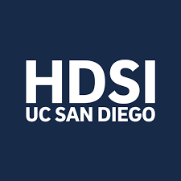

  

      &nbsp;&nbsp;&nbsp;&nbsp;&nbsp;&nbsp;&nbsp;&nbsp;
    
  

# DSC-291A: Numerical Linear Algebra (SP'22)

Numerical Linear Algebra is a fundamental tool for data science and machine learning. This course will introduce basic concepts and provide a mathematical foundation for research in machine learning and data science. We will discuss how numerical linear algebra is useful and essential in several key machine learning and data science topics.

## Course Contents
- Fundamentals
  - matrix
  - orthogonality
  - norms
  - SVD
  - QR factorization
  - Gram-Schmidt Orthogonalization
  - Numerical methods
- Conditioning and Stability
- Application to Machine Learning and Data science topics
  - Least squares problems
  - Kernel methods
  - Principal component analysis
  - Neural network robustness verification

## Course Staff

- Instructor: Prof. Lily Weng, HDSI 
- TA:  Yash Khandelwal, CSE

For contact information, see [this](staff) page.

## Course Logistics 

For course logistics, see [this](logistics) page.